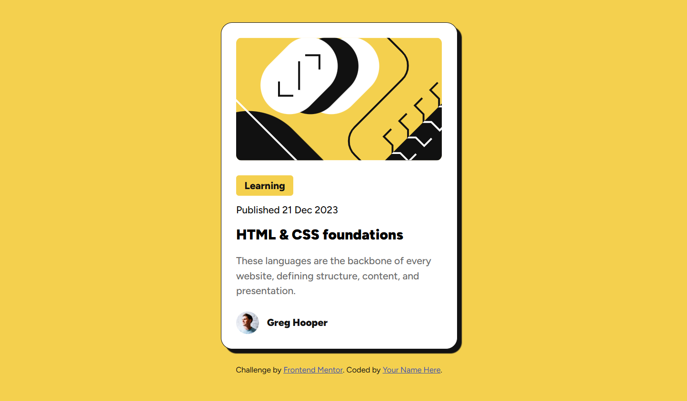

# Frontend Mentor - Blog preview card solution

This is a solution to the [Blog preview card challenge on Frontend Mentor](https://www.frontendmentor.io/challenges/blog-preview-card-ckPaj01IcS). Frontend Mentor challenges help you improve your coding skills by building realistic projects. 

## Table of contents

- [Overview](#overview)
  - [The challenge](#the-challenge)
  - [Screenshot](#screenshot)
  - [Links](#links)
- [My process](#my-process)
  - [Built with](#built-with)
  - [What I learned](#what-i-learned)

**Note: Delete this note and update the table of contents based on what sections you keep.**

## Overview

### The challenge

Users should be able to:

- See hover and focus states for all interactive elements on the page

### Screenshot



### Links

- Live Site URL: https://github.com/davidrapu/blog-preview-card-challenge

## My process

### Built with

- Semantic HTML5 markup
- CSS custom properties
- Flexbox

**Note: These are just examples. Delete this note and replace the list above with your own choices**

### What I learned

- Using the 100vh as the height of the body you need to remove the margin that is automatically added to the body so it does take more than the actual viewport height

```css 
body{
  margin: 0;
  height: 100vh;
}
```
